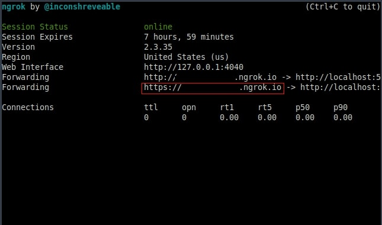

# CoinGeckoTelegramBotAPI

## What you're building
 This tutorial will help you to understand how to build simpe Telegram bot API with python and [Webhook](https://core.telegram.org/bots/webhooks) to get actual cryptocurrency price from price-tracking websites for cryptoassets (in our case - [CoinGecko](https://www.coingecko.com/en) website)


 ### Requirements:
 1. [Python](https://docs.python.org/3.7/) v3.7.0
 2. [Flask](https://flask.palletsprojects.com/en/1.1.x/) v1.1.2
 3. [Flask-SSLify](https://pypi.org/project/Flask-SSLify/) v.0.1.5


 ### Setup
 Create a directory for the project:
 ```
 $ mkdir /directory name/ && cd /directory name/
 ```
 Create and activate [python virtual environment](https://docs.python.org/3.7/library/venv.html#venv-def):
 ```
 $ python3.7 -m venv .venv
 $ source .venv/bin/activate
 (.venv)$
 ```
Install Flask with pip:
```
(.venv)$ pip install flask==1.1.2
```


Create following file in working directory:
```
.
|__ main.py
```

> Note: You also may create [.gitignore](https://git-scm.com/docs/gitignore) file for your [Git](https://git-scm.com/about) repository, if it necessary.


Create telegram bot with [BotFather](https://core.telegram.org/bots#3-how-do-i-create-a-bot) in your Telegram app.


### Create app
Update *main.py* with the following code to test local server:

```python

from flask import Flask

app = Flask(__name__)

@app.route("/")
def index():
    return "<h5>some text</h5>"

if __name__ == "__main__":
    app.run(debug=True)
```
Visit http://127.0.0.1:5000/ and you should see text defined in function.


### PythonAnywhere Configuration
Create a free account on [PythonAnywhere](https://www.pythonanywhere.com) - this is an online integrated development environment (IDE), and web hosting service (Platform as a service) for python web applications also. After that, using *Bash Console* (find it in *Dashboard* tab), create virtual environment on virtual service:
```
$ virtualenv .venv --python=python3.7
```
> Note: Must used the same python version as in created virtual environment on you computer.

Activate and check virtualenv, install Flask:
```
$ source .venv/bin/activate
(.venv)$ pip --version
(.venv)$ pip install flask
```

Open *Files* tab, create *New directory* for the app, and upload file *main.py* from your computer on service. After that open *Web* tab, choose *Add a new web app* and configure web app by steps: *Next* --> *Manual configuration* --> *Python3.7* --> *Next*. On appeared web page with configurations, in section *Code* set up path to web app source code, in section *Virtualenv* set up path to a virtualenv as well.

> Note: Path to the virtual environment can be checked with [*pwd*](https://www.tecmint.com/pwd-command-examples/) command in *Bash Console*:
```
(.venv)$ pwd
home/username/.venv
```  

Further, in section *Code* update *WSGI configuration file*. Open file and in section for Flask uncomment following strings:
```
import sys

path = '/home/username/foldef_for_web_app'
if path not in sys.path:
    sys.path.append(path)
```
Also uncomment string:
```
from main_flask_app_file import app as application
```
and change it to:
```
from main import app as application
```

Save file, open *Web* tab, reload and open web app. Web page will show text from main.py file. Next step -- to change unsecure connection for our web app page to secure. To fix it we use Flask-SSLify, and install this package in virtual environment both on computer and virtual server:
```
(.venv)$ pip install flask-sslify
```
Update file main.py with following code:
```python
from flask import Flask
from flask_sslify import SSLify


app = Flask(__name__)
sslify = SSLify(app)


@app.route("/")
def index():
    return "<h5>Some text</h5>"


if __name__ == "__main__":
    app.run()
```
Renew main.py on virtual service, reload web app and check app's web page for secure connection.


### Developing app
Import [*requests*](https://pypi.org/project/requests/) library on your computer:
```
(.venv)$ pip install requests
```

To get general data about created telegram bot, update main.py with code below:
```python
import requests
from flask import Flask


URL = "https://api.telegram.org/bot<token>/"


def main():
    r = requests.get(URL + "getMe")
    print(r.json())


if __name__ == "__main__":
    main()

```

Run the file and in terminal you will see a data about telegram bot, represented as python dictionary. Record recieved data to [json](https://docs.python.org/3.7/library/json.html) formate file using following code:
```python
import json

import requests
from flask import Flask


URL = "https://api.telegram.org/bot<token>/"


def write_json(data, filename="bot_data.json"):
    with open(filename, "w") as file:
    json.dump(data, file, indent=2, ensure_ascii=False)


def main():
    r = requests.get(URL + "getMe")
    write_json(r.json())


if __name__ == "__main__":
    main()
```

Update telegram bot data with [*getUpdates*](https://core.telegram.org/bots/api#getupdates) method:
```python
import json

import requests
from flask import Flask


URL = "https://api.telegram.org/bot<token>/"


def write_json(data, filename="bot_data.json"):
    with open(filename, "w") as file:
    json.dump(data, file, indent=2, ensure_ascii=False)


def get_updates():
    url = URL + "getUpdates"
    r = requests.get(url)
    write_json(r.json())


def main():
    get_updates()


if __name__ == "__main__":
    main()
```
> Note: Check it, starting your telegram bot, and send some message -- function get_updates will return nested python dictionary with latest data. Updated data will be automatically written in bot_data.json file

Using identificationl information from recieved data, we can send message to telegram bot with [*sendMessage*](https://core.telegram.org/bots/api#sendmessage) method directly from code editor:
```python
import json

import requests
from flask import Flask


URL = "https://api.telegram.org/bot<token>/"


def write_json(data, filename="bot_data.json"):
    with open(filename, "w") as file:
    json.dump(data, file, indent=2, ensure_ascii=False)


def get_updates():
    url = URL + "getUpdates"
    r = requests.get(url)
    write_json(r.json())


def send_message(chat_id, text="some text")
    url = URL + "sendMessage"
    answer = {"chat_id": chat_id, "text": text}
    r = requests.post(url, json=bot_data)
    return r.json()


def main():
    r = get_updates()
    chat = r["result"]["message"]["chat"]["id"]
    send_message(chat_id)


if __name__ == "__main__":
    main()
```

To avoid bot having to ask for updates frequantly and recieve bot data updates automatically, prefer to use not *getUpdates* method, but [*setWebhook*](https://core.telegram.org/bots/api#setwebhook) instead. Set up Webhook with [*ngrok*](https://ngrok.com/product) to build https tunnel to localhost. Download ngrock, unpack archive in home directory on your computer, and type in terminal:
```
$ ngrok http 5000
```
Choose https connection:



Copy tunel address and past it in URL line as additional parameter to *setWebhook* method. The line should be look:
```
https://api.telegram.org/bot<token>/setWebhook?url=<ngrock_tunel_adress>/
```
Past the line in new web browser window -- the answer must be "Webhook was set".


After that update code in *main.py* with POST and GET methods:
```python
import json

import requests
from flask import Flask, jsonify, request


URL = "https://api.telegram.org/bot<token>/"


def write_json(data, filename="bot_data.json"):
    with open(filename, "w") as file:
    json.dump(data, file, indent=2, ensure_ascii=False)


def get_updates():
    url = URL + "getUpdates"
    r = requests.get(url)
    write_json(r.json())


def send_message(chat_id, text="some text")
    url = URL + "sendMessage"
    answer = {"chat_id": chat_id, "text": text}
    r = requests.post(url, json=bot_data)
    return r.json()


@app.route("/", methods=["POST", "GET"])
def index():
    if request.method == "POST":
        r = request.get_json()
        write_json(r)
        return jsonify(r)
    return "<h1>some text</h1>"


def main():
    pass


if __name__ == "__main__":
    app.run()
```

> Note: Send some message to your telegram bot -- if all is correct, bot will return text from index function and update bot_data.json file with new data.


Update *index* function to parse new data in bot_data.json.
```python
import json

import requests
from flask import Flask, jsonify, request


URL = "https://api.telegram.org/bot<token>/"


def write_json(data, filename="bot_data.json"):
    with open(filename, "w") as file:
    json.dump(data, file, indent=2, ensure_ascii=False)


def get_updates():
    url = URL + "getUpdates"
    r = requests.get(url)
    write_json(r.json())


def send_message(chat_id, text="some text")
    url = URL + "sendMessage"
    answer = {"chat_id": chat_id, "text": text}
    r = requests.post(url, json=bot_data)
    return r.json()


@app.route("/", methods=["POST", "GET"])
def index():
    if request.method == "POST":
        r = request.get_json()
        chat_id = r["message"]["chat"]["id"]
        message = r["message"]["text"]

        if "ethereum" in message:
            send_message(chat_id, text="some text")
        return jsonify(r)
    return "<h1>some text</h1>"


def main():
    pass


if __name__ == "__main__":
    app.run()
``` 

>Note: Check bot again -- send message with "ethereum" word to recieve the answer with text you set in the index function.


### Parse cryptocurrency price data from CoinGecko
[*CoinGecko*](https://www.coingecko.com/en/api) has powerfull and free API, so no personal API keys required.

Update file main.py with following code:
```python
import json
import requests

from flask import Flask, jsonify, request


URL = "https://api.telegram.org/bot<token>/"


def write_json(data, filename="bot_data.json"):
    with open(filename, "w") as file:
    json.dump(data, file, indent=2, ensure_ascii=False)


def get_updates():
    url = URL + "getUpdates"
    r = requests.get(url)
    write_json(r.json())


def send_message(chat_id, text="some text")
    url = URL + "sendMessage"
    answer = {"chat_id": chat_id, "text": text}
    r = requests.post(url, json=bot_data)
    return r.json()


def get_price():
    url = (
        "https://api.coingecko.com/api/v3/coins/markets?vs_currency=usd&ids=bitcoin"
    )
    r = requests.get(url)
    write_json(r.json(), filename='price.json')


@app.route("/", methods=["POST", "GET"])
def index():
    if request.method == "POST":
        r = request.get_json()
        chat_id = r["message"]["chat"]["id"]
        message = r["message"]["text"]

        if "ethereum" in message:
            send_message(chat_id, text="some text")
        return jsonify(r)
    return "<h1>some text</h1>"


def main():
    get_price()


if __name__ == "__main__":
    main()
``` 

To get current price from recieved data from CoinGecko, update get_price function by following code:
```python
import json

import requests
from flask import Flask, jsonify, request


URL = "https://api.telegram.org/bot<token>/"


def write_json(data, filename="bot_data.json"):
    with open(filename, "w") as file:
    json.dump(data, file, indent=2, ensure_ascii=False)


def get_updates():
    url = URL + "getUpdates"
    r = requests.get(url)
    write_json(r.json())


def send_message(chat_id, text="some text")
    url = URL + "sendMessage"
    answer = {"chat_id": chat_id, "text": text}
    r = requests.post(url, json=bot_data)
    return r.json()

def get_price():
    url = "https://api.coingecko.com/api/v3/coins/markets?vs_currency=usd&ids=bitcoin"
    r = requests.get(url).json()
    price = r[-1]["current_price"]
    return price


@app.route("/", methods=["POST", "GET"])
def index():
    if request.method == "POST":
        r = request.get_json()
        chat_id = r["message"]["chat"]["id"]
        message = r["message"]["text"]

        if "ethereum" in message:
            send_message(chat_id, text="some text")
        return jsonify(r)
    return "<h1>some text</h1>"


def main():
    print(get_price())


if __name__ == "__main__":
    main()
```

Using [*re*](https://docs.python.org/3.7/library/re.html) module, we can configure parsing data from web site for each cryptocurrency:

```python
import json
import re

import requests
from flask import Flask, jsonify, request


URL = "https://api.telegram.org/bot<token>/"


def write_json(data, filename="bot_data.json"):
    with open(filename, "w") as file:
    json.dump(data, file, indent=2, ensure_ascii=False)


def get_updates():
    url = URL + "getUpdates"
    r = requests.get(url)
    write_json(r.json())


def send_message(chat_id, text="some text")
    url = URL + "sendMessage"
    answer = {"chat_id": chat_id, "text": text}
    r = requests.post(url, json=bot_data)
    return r.json()


def parse_text(text):
    pattern = r"=\w+"
    crypto = re.search(pattern, text).group()
    return crypto[1:]


def get_price(crypto):
    url = (
        "https://api.coingecko.com/api/v3/coins/markets?vs_currency=usd&ids={}".format(
            crypto
        )
    )
    r = requests.get(url).json()
    price = r[-1]["current_price"]
    return price


@app.route("/", methods=["POST", "GET"])
def index():
    if request.method == "POST":
        r = request.get_json()
        chat_id = r["message"]["chat"]["id"]
        message = r["message"]["text"]

        if "ethereum" in message:
            send_message(chat_id, text="some text")
        return jsonify(r)
    return "<h1>some text</h1>".


def main():
    print(get_price(parse_text('How much is =ethereum?')))


if __name__ == "__main__":
    main()
```
> Note: You can change '=ethereum' by another crypto to check functions correct work.


Update code to recieve cryptocurrency with telegram bot:
```python
import json
import re

import requests
from flask import Flask, jsonify, request


URL = "https://api.telegram.org/bot<token>/"


def write_json(data, filename="bot_data.json"):
    with open(filename, "w") as file:
    json.dump(data, file, indent=2, ensure_ascii=False)


def get_updates():
    url = URL + "getUpdates"
    r = requests.get(url)
    write_json(r.json())


def send_message(chat_id, text="some text")
    url = URL + "sendMessage"
    answer = {"chat_id": chat_id, "text": text}
    r = requests.post(url, json=bot_data)
    return r.json()


def parse_text(text):
    pattern = r"=\w+"
    crypto = re.search(pattern, text).group()
    return crypto[1:]


def get_price(crypto):
    url = (
        "https://api.coingecko.com/api/v3/coins/markets?vs_currency=usd&ids={}".format(
            crypto
        )
    )
    r = requests.get(url).json()
    price = r[-1]["current_price"]
    return price


@app.route("/", methods=["POST", "GET"])
def index():
    if request.method == "POST":
        r = request.get_json()
        chat_id = r["message"]["chat"]["id"]
        message = r["message"]["text"]

        pattern = r"=\w+"

        if re.search(pattern, message):
            price = get_price(parse_text(message))
            send_message(chat_id, text=price)
        return jsonify(r)
    return "<h1>Hello bot</h1>"


if __name__ == "__main__":
    app.run(debug=True)
```
>Note: Type to telegram bot "/=bitcoin" or another crypto to reciece price.


Add SSLify again:
```python
import json
import re

import requests
from flask import Flask, jsonify, request
from flask_sslify import SSLify

app = Flask(__name__)
sslify = SSLify(app)

# Leave the rest of the code unchanged

```
Next step -- delete Webhook from localhost. Type following URL in web browser and will see a message 'Webhook was deleted'
```
https://api.telegram.org/bot<token>/deleteWebhook
```

> Note: Telegrame avoid to use open token.

Now open PythonAnywhere *Files* tab, open folder with web app and upload *main.py* file with the latest changes. Then in tab *Web* reload web app.
> Note: if web page will show you, that mistakes exists, open *pythonanywhere.com.error.log* and see, what is wrong.


After that copy url adrress of web app and set Webhook again with our URL:
```
https://api.telegram.org/bot<token>/setWebhook?url=https://<username>.pythonanywhere.com/
```

Finally, our bot should be work properly. Check in telegram.


> Warning: Avoid to use tokens as open data. 